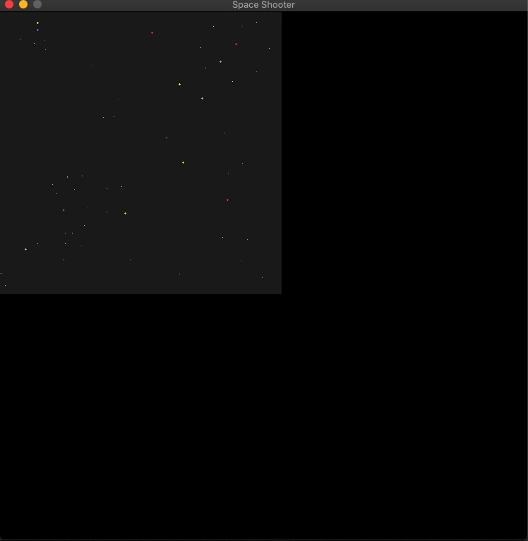
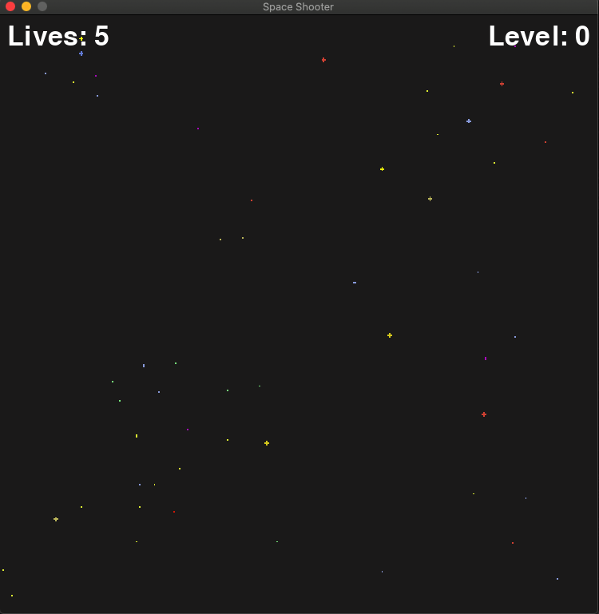
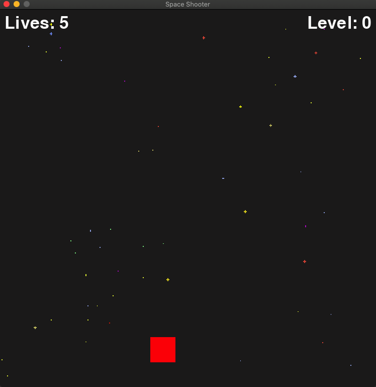
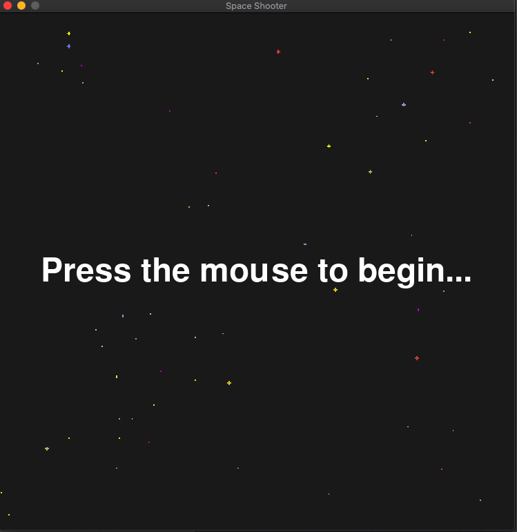
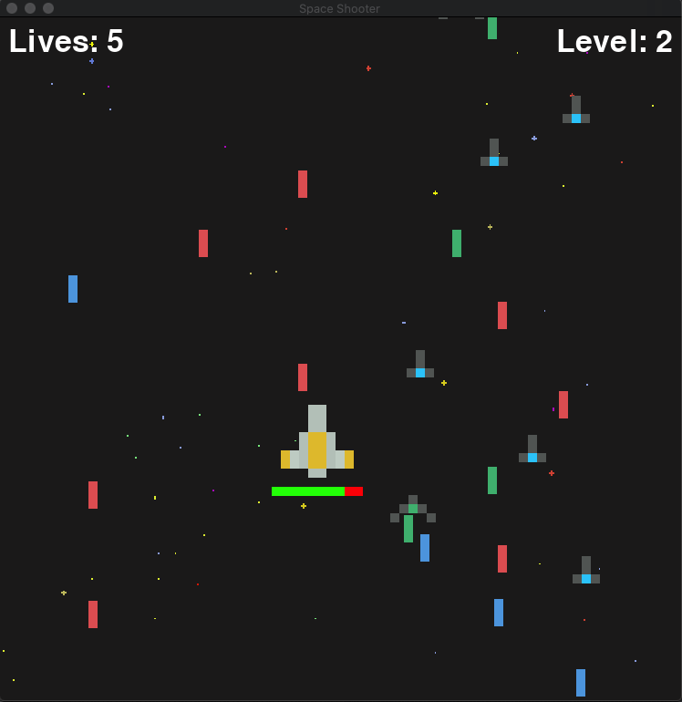

# Space Invaders in Python

```shell
pipenv install "git+https://github.com/pygame/pygame.git#egg=pygame"
```
or run `pip3 install -r requirements.txt`

## Execute

```shell
pypenv run python main.py
```

## Screenshots

<p align="center">
  <kbd>
    
  </kbd>
</p>

<p align="center">
  <kbd>
    
  </kbd>
</p>

<p align="center">
  <kbd>
    
  </kbd>
</p>

<p align="center">
  <kbd>
    
  </kbd>
</p>

<p align="center">
  <kbd>
    
  </kbd>
</p>
